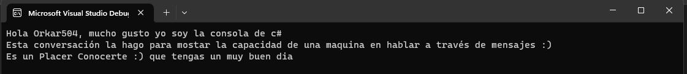
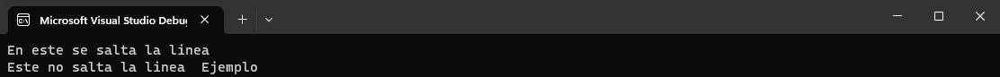
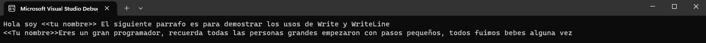

# C# REPOSITORIO

## GITHUB USER: Orkar504

## MOTIVO

El motivo del siguiente repositorio es para mejorar mis habilidades de **C#** mediante la revisión de la documentación dentro de w3school.com. Luego de revisar y completar la revisión de la plataforma antes mencionada se pasara a indagara los cursos de c# de Microsoft ofrecidos en su plataforma.

## Planificación
Primero Indagaremos en la sintaxis básica de c# para luego realizar un pequeño proyecto al momento de lectura de archivos, ser capaz de identificar y leer cualquier extensión de archivos para luego realizar un DAO para leer e interpretar estos datos, esto con el fin de utilizarlo en futuros proyectos.  
# Lenguaje de Programación
## C#

C# (pronunciado "C sharp") es un lenguaje de programación orientado a objetos desarrollado por Microsoft. Fue creado como parte de la plataforma .NET para facilitar el desarrollo de aplicaciones de software tanto en el ámbito de escritorio como en el ámbito web. C# combina elementos de lenguajes como C++ y Java, y se enfoca en la simplicidad, la seguridad y la facilidad de uso.## Plataformas a utilizar 
### W3SCHOOLS


W3Schools es un recurso en línea ampliamente utilizado para aprender y mejorar las habilidades de desarrollo web y programación. Fundado en 1998, W3Schools proporciona tutoriales, ejemplos de código, y documentación sobre una amplia gama de tecnologías y lenguajes web, incluyendo HTML, CSS, JavaScript, SQL y más.

El sitio web está diseñado de manera simple y fácil de entender, lo que lo convierte en una opción popular tanto para principiantes que están dando sus primeros pasos en el mundo del desarrollo web, como para profesionales que buscan información rápida y soluciones a problemas específicos. Cada tutorial generalmente incluye explicaciones detalladas, ejemplos prácticos y la oportunidad de interactuar con el código en tiempo real en un "editor de código en línea".

> github.com/Orkar504
### learn.Microsoft


Microsoft Learn es una plataforma educativa en línea creada por Microsoft que tiene como objetivo proporcionar recursos de aprendizaje para ayudar a las personas a adquirir habilidades en diversas tecnologías y productos de Microsoft. La plataforma ofrece una amplia gama de contenido educativo, desde principiante hasta avanzado, en áreas como desarrollo de software, administración en la nube, análisis de datos, inteligencia artificial, seguridad cibernética y más.

> github.com/Orkar504

## Herramienta a Utilizar 

Visual Studio es un entorno integrado de desarrollo (IDE, por sus siglas en inglés) desarrollado por Microsoft. Está diseñado para ayudar a los programadores y desarrolladores en la creación, depuración y mantenimiento de software, ya sea para aplicaciones de escritorio, web, móviles o de otro tipo. Visual Studio ofrece una amplia gama de herramientas y funciones que facilitan todo el ciclo de vida del desarrollo de software.


# Los Codigos
Se estará actualizando este README.md cada vez que se genere un nuevo codigo con una explicación sencilla junto a un programa mas de aplicación de lo aprendido.

## ¡Comencemos!
Una vez descargado e instalado Visual Studio 2022 empezamos.
Como todo buen inicio debemos empezar con lo básico, primero abriremos Visual Studio 2022 luego seleccionaremos crear nuevo proyecto, de ahi iremos a crear una nueva aplicación de consola. Le colocamos el nombre deseado al proyecto y damos inicio.

Luego de todo esto borramos Cualquier archivo .cs que nos cree el proyecto para asi empezar de cero. Con esto hacemos click derecho en el explorador de soluciones y creamos un nuevo archivo llamado Programa.cs para asi empezar con nuestro proyecto.
## El Mítico "Hola mundo"

En la programación tenemos una práctica simple pero bien bonita, lo que se le conoce como el *Hola mundo*. 
La sintaxis para lograr que la computadora nos hable en C# es la siguiente:
```
Console.WriteLine("Hola Mundo");
```
Esta instrucción simple pero maravillosa nos permite hablar que la computadora nos hable, le decimos al mundo **HOLA** estoy aqui a través del código. ¡¡¡Es fascinante podemos hacer que una computadora hable!!! 

<br></br>
El siguiente código es un ejemplo de implementar el 
> Console.WriteLine("Hola Mundo");
```
using System;


namespace CSHARP //El "CSHARP" es el nombre del Proyecto
{
    internal class Programa //Programa es el nombre del archivo .cs
    {
        static void Main(string[] args)
        {
            Console.WriteLine("Hola Mundo");
        }
    }
}

```

> Imagen 


Utilizamos System para poder ejecutar los comandos como Console.
El namespace representa el nombre de nuestro proyecto en este caso **CSHARP**, el nombre **Programa**  En la clausa de internal class  es el nombre del Programa.
Utilizamos Static void Main para indicar que esta método es el principal en ejecutar al momento ejecutar nuestro Proyecto.

Este programa no enseña lo que es imprimir en consola, como mostarle al usuario a traves de una consola como utilizar esto para fúturos proyectos que iremos indagando a traves de este repositorio de github.com/@Orkar504 para que así logremos comprender e implementar c# en nuestra programación.
 
 <br></br>
 **¡Ahora empezaremos con la aplicación!**

 ## Una conversación unilateral 
 El siguiente programa tratará de simular que una computadora nos esta contando algo, ya sea algo simple como fui a la tienda o algo mas complejo como una pequeña historia. 
 Así que empezemos :)

 ### Cambios a realizar :o
 Bien indagaremos acerca de los cambios a realizar para que en el futuro del proyecto no tengamos inconvenientes.
 Primero realizaremos estos cambios sin explicación y a medidad que avancemos en este proyecto los iremos describiendo poco a poco.

 Bien crearemos un nuevo archivo .cs llamado:
 > Principal.cs

 Este Main haremos los llamados para todos los futuros programas y tendra la siguiente sintaxis:

 ```
using System;

namespace CSHARP //El "CSHARP" es el nombre del Proyecto
{
    internal class Principal //"Programa" es el nombre del archivo .cs
    {
        static void Main(String[] args) //El static void Main es para indicar que esta función se ejecutará primero cuando se ejecture el programa
        {
            /*Codigo*/
        }
    }
}

 ```

 Con esto completo, realizaremos varios cambios en el archivo .cs llamado:
 > Programa.cs
 ```
 using System;

namespace CSHARP //El "CSHARP" es el nombre del Proyecto
{
    internal class Programa //"Programa" es el nombre del archivo .cs
    {
       
        static void HolaMundo() //Usamos HolaMundo() sustituyendo  el static void Main.
        {
            Console.WriteLine("Hola Mundo");
        }
    }
}

 ```
 ### Maquina Parlante
 Primero crearemos un nuevo archivo .cs llamado
 > Maquina Parlante.cs
 
 Aquí haremos nuestra maquina parlante de la siguiente manera
 ```
 using System;

namespace CSHARP //El "CSHARP" es el nombre del Proyecto
{
    internal class MaquinaParlante //"MaquinaParlante" es el nombre del archivo .cs
    {
        public void Mensaje() //Este es el nombre del método
        {
            Console.WriteLine("Hola <<Tu nombre>>, mucho gusto yo soy la consola de c#");
            Console.WriteLine("Esta conversación la hago para mostar la capacidad de una maquina en hablar a través de mensajes :)");
            Console.WriteLine("Es un Placer Conocerte :) que tengas un muy buen dia");
        }
    }
}
 ```

 ¿Pero, como MaquinaParlante no tiene un static void Main(strings[] args) como lo podremos llamar?
 Aqui es donde entran los llamados a los métodos. como mencione anteriormente no explicare a detalle en este punto que son los llamados a métodos, es algo mas complicado que veremos adelante.
 
 Nos iremos al siguiente archivo:
 > Principal.cs

 En este escribiremos el siguiente código:
 ```
 using System;

namespace CSHARP //El "CSHARP" es el nombre del Proyecto
{
    internal class Principal
    {
        static void Main(String[] args)
        {
            MaquinaParlante mensaje = new MaquinaParlante(); //Llamar a maquina Parlante

            mensaje.Mensaje(); //Ejecutar el método mensaje de Maquina Parlante
        }
    }
}
 ```
 Con este código llamamos al archivo maquina parlante y ejecutamos su método Mensaje() que no permite mostrar el mensaje que escribimos en el programa.
 
 Con esto  nos debería dar el siguiente mensaje en la consola:
 

 ### Sintaxis
 C# como todo lenguaje de programación tiene sus reglas de sintaxis, este permite mantener un orden al momento de codificar y hacer programas.
 
 El siguiente código es un ejemplo de como funciona la sintaxis de c#

 ```
 using System; //Para utilizar las clases relacionadas al sistema, de ahi su nombre system


//Las líneas vacías las ignora c#, pero es una buena práctica dejar una división para mejor legibilidad

// se utilizan las // para hacer un comentario
// Se utiliza /**/ para hacer un bloque de comentario

namespace CSHARP //namespace es utilizado para organizar el código, es el contenedor para otras clases y otros namespaces
{ // Las {} son indicador de donde empieza y termina un bloque de código
    public class Syntaxis // la palabra reservada class es un contenedor de datos  métodos, esta permite la funcionalidad de tu programa
    {
        public void sintaxis() //Este es un método, permite la funcionalidad del código
        {

            /*static void Main(string[] args) // Main es donde se ejecuta cualquier código que este dentro de este bloque
            {

            } */

            Console.WriteLine("Explicando la sintaxis de c#"); // Console es una clase de System,  
            Console.WriteLine("Explicando el ;"); //Toda línea de código o sentencia siempre debe terminar con ;


        }
    }


}
 ```

  ***Using System;*** se coloca para para utilizar las clases relacionadas al sistema

  Las ***líneas vacías*** en c# son ignoradas, pero sirven para dar orden y legibilidad al código
  
  Los ***//*** Se utilizan para comentar código, como es el caso del código antes mencionado.
  >// Este es un comentario en c#

  

  El /* de inicio y el */ de salida nos sirven para realizar comentarios de bloque como el siguiente ejemplo:
  ```
  /*
  Esto seria solo un comentario en c#
  aunque yo coloque:
  Console.WriteLine("Hola Mundo");
  No se va a ejecutar, debido a que es un comentario
  */
  ```
  #### Los comentarios 
  Los comentarios en C# sirven para dar un norte de que hace el código, también puede servir como referencia cuando se vuelva a visitar el código saber con mayor facilidad de que se trata

  El ***namespace*** se utiliza para organizar el código, es el contenedor de clases y otros namespace

  Las <strong>"{ " "}"</strong> son utilizadas para indicar donde empieza y termina un bloque de código
  ```
  { // aqui empieza el bloque código

  /* Código */


  } //aqui termina el bloque de código
  ```
  La palabra reservada ***class*** se utiliza como un contenedor de datos, métodos, esto permite la funcionalidad del código
  ```
  public class Syntaxis
  {
  //método a
  //método b
  .
  .
  .
  //método z

  }

  ```


  La palabra reservada ***public*** es para indicar que cualquier clase o código pueda hacer uso de este método
  La palabra reservada ***void*** es un método, y es algo que no retona nada,su traducción en español es ***"vacio"***
  ```
  public void sintaxis ()
  {
        /*Código*/
  }
  ```

  El ***static void Main(string[] args)*** **{**  **}** es la función principal en cualquier proyecto de c#, este se ejecuta siempre.
  
  Un ejemplo del uso de métodos de ***System*** es la palabra reservada ***Console*** que permite generar salidas como por ejemplo
  > Console.WriteLine("Hola Mundo");

  sino se usara system se tendría que escribir de la siguiente manera

  > System.Console.WriteLine("Hola Mundo);

 ### El famoso :
 # ;
 El punto y coma ";" es la pesadilla de nuevo y antiguos programadores, en el caso de c# toda sentencias/línea de código debe terminar con un punto y coma

 ahora para llamar a Sintaxis usamos el siguiente llamado en principal:

 ```
 using System;

namespace CSHARP
{
    internal class Principal
    {
        static void Main(String[] args)
        {
            /*
             Llamar a Syntax
             */
            Syntaxis syntax = new Syntaxis();
            syntax.sintaxis();


        }
    }
}
 ```
 
 ### En esta ocasión no hay código extra


 ## Las Salidas o mejor conocidas en Ingles como "output"
 Las salidas o "outputs" es como nosotros los programadores podemos decirle a la computadora que nos responda cuando le damos una instrucción.
 Estas nos ayudan de diferentes maneras que iremos describiendo mientras avanzamos en el curso.

 el programa:
 ### Salidas
 En esta ocasión el siguiente código es un ejemplo de como usar las salidas o "outputs" en c#
 ```
 using System;


namespace CSHARP
{
    internal class Salidas
    {
        public void salida()
        {
            Console.WriteLine("En este se salta la linea"); // Este salta linea cada vez 
            Console.Write("Este no salta la linea"); //Write no salta lineas 
            Console.Write("  Ejemplo");
        }
    }
}
 ```

 El ***WriteLine*** cada vez que se utiliza realiza un salto de linea.

 El ***Write*** es similar a ***WriteLine*** Solo que este no realiza un salto de linea

 Ejemplo de la consola:
 

 > Como invocar Salidas en Principal:
 ```
 using System;

namespace CSHARP
{
    internal class Principal
    {
        static void Main(String[] args)
        {
           
            /*Llamar a Salidas*/
            Salidas salida = new Salidas();
            salida.salida();
          
        }
    }
}
 ```
 #### Salidas2
 Ahora utilizando este nuevo conocimiento crearemos un programa pequeño utilizando tanto ***WriteLine*** como ***Write***

 Haremos un programa que genere un parrafo con sus saltos de linea, utilizaremos Write como manera de colocar datos concretos que podamos cambiar dentro del código.
 ¡¡¡Empezemos!!!

 Código:
 ```
 using System;


namespace CSHARP
{
    internal class Salidas2
    {
       public void salidas2()
        {
            Console.Write("Hola soy <<tu nombre>> ");
            Console.WriteLine("El siguiente parrafo es para demostrar los usos de Write y WriteLine");
            Console.Write("<<Tu nombre>> ");
            Console.WriteLine("Eres un gran programador, recuerda todas las personas grandes empezaron con pasos pequeños, todos fuimos bebes alguna vez");
        }

    }
}
 ```

 Código para llamar esta clase desde principal: 
 ```
 using System;

namespace CSHARP
{
    internal class Principal
    {
        static void Main(String[] args)
        {
         
            /* Llamar a salidas 2*/

            Salidas2 salida2 = new Salidas2();
            salida2.salidas2();


        }
    }
}

 ```

 Y la consola nos muestra el siguiente mensaje:
 

 # ¡Felíz Programación!
 ---
 By: @Orkar504