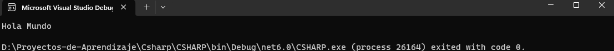

# C# REPOSITORIO

## GITHUB USER: Orkar504

## MOTIVO

El motivo del siguiente repositorio es para mejorar mis habilidades de **C#** mediante la revision de la documentacion dentro de w3school.com. uego de revisar y completar la revision de la plataforma antes mencionada se pasara a indagara los cursos de c# de Microsoft ofrecidos en su plataforma.

## Planificacion
Primero Indagaremos en la sintaxis basica de c# para luego realizar un pequeño proyecto al momento de lectura de archivos, ser capaz de identificar y leer cualquier extensión de archvos para luego realizar un DAO para leer e interpretar estos datos, esto con el fin de utilizarlo en futuros proyectos.  

## Plataformas a utilizar 
### W3SCHOOLS


W3Schools es un recurso en línea ampliamente utilizado para aprender y mejorar las habilidades de desarrollo web y programación. Fundado en 1998, W3Schools proporciona tutoriales, ejemplos de código, y documentación sobre una amplia gama de tecnologías y lenguajes web, incluyendo HTML, CSS, JavaScript, SQL y más.

El sitio web está diseñado de manera simple y fácil de entender, lo que lo convierte en una opción popular tanto para principiantes que están dando sus primeros pasos en el mundo del desarrollo web, como para profesionales que buscan información rápida y soluciones a problemas específicos. Cada tutorial generalmente incluye explicaciones detalladas, ejemplos prácticos y la oportunidad de interactuar con el código en tiempo real en un "editor de código en línea".

> github.com/Orkar504
### learn.Microsoft


Microsoft Learn es una plataforma educativa en línea creada por Microsoft que tiene como objetivo proporcionar recursos de aprendizaje para ayudar a las personas a adquirir habilidades en diversas tecnologías y productos de Microsoft. La plataforma ofrece una amplia gama de contenido educativo, desde principiante hasta avanzado, en áreas como desarrollo de software, administración en la nube, análisis de datos, inteligencia artificial, seguridad cibernética y más.

> github.com/Orkar504

## Herramienta a Utilizar 

Visual Studio es un entorno integrado de desarrollo (IDE, por sus siglas en inglés) desarrollado por Microsoft. Está diseñado para ayudar a los programadores y desarrolladores en la creación, depuración y mantenimiento de software, ya sea para aplicaciones de escritorio, web, móviles o de otro tipo. Visual Studio ofrece una amplia gama de herramientas y funciones que facilitan todo el ciclo de vida del desarrollo de software.


## Los Codigos
Se estará actualizando este README.md cada vez que se genere un nuevo codigo con una explicación sencilla junto a un programa mas de aplicación de lo aprendido.

### ¡Comencemos!
Una vez descragado e instalado Visual Studio 2022 empezamos.
Como todo buen inicio debemos empezar con lo básico, primero abriremos Visual Studio 2022 luego seleccionaremos crear nuevo proyecto, de ahi iremos a crear una nueva aplicación de consola. Le colocamos el nombre deseado al proyecto y damos inicio.

Luego de todo esto borramos Cualquier archivo .cs que nos cree el proyecto para asi empezar de cero. Con esto hacemos click derecho en el explorador de soluciones y creamos un nuevo archivo llamado Programa.cs para asi empezar con nuestro proyecto.
### El Mítico "Hola mundo"

En la programación tenemos una práctica simple pero bien bonita, lo que se le conoce como el *Hola mundo*. 
La sintaxis para lograr que la computadora nos hable en C# es la siguiente:
```
Console.WriteLine("Hola Mundo");
```
Esta instrucción simple pero maravillosa nos permite hablar con la computadora, le decimos al mundo **HOLA** estoy aqui. ¡¡¡Es fascinante podemos hacer que una computadora hable!!! 

<br></br>
El siguiente código es un ejemplo de implementar el 
> Console.WriteLine("Hola Mundo");
```
using System;


namespace CSHARP //El CSHARP es el nombre del Proyecto
{
    internal class Programa //Programa es el nombre del archivo .cs
    {
        static void Main(string[] args)
        {
            Console.WriteLine("Hola Mundo");
        }
    }
}

```

> Imagen 


Utilizamos System para poder ejecutar los comandos como Console.
El namespace representa el nombre de nuestro proyecto en este caso **CSHARP**, el nombre **Programa**  En la clausa de internal class  es el nombre del Programa..

Este programa no enseña lo que es imprimir en consola, como mostarle al usuario a traves de una consola como utilizar esto para fúturos proyectos que iremos indagando a traves de este repositorio de github.com/@Orkar504 para que así logremos comprender e implementar c# en nuestra programación.
 
 <br></br>
 **¡Ahora empezaremos con la aplicación!**

 ### Una conversación unilateral 
 El siguiente programa tratará de simular que una computadora nos esta contando algo, ya sea algo simple como fui a la tienda o algo mas complejo como una pequeña historia. 
